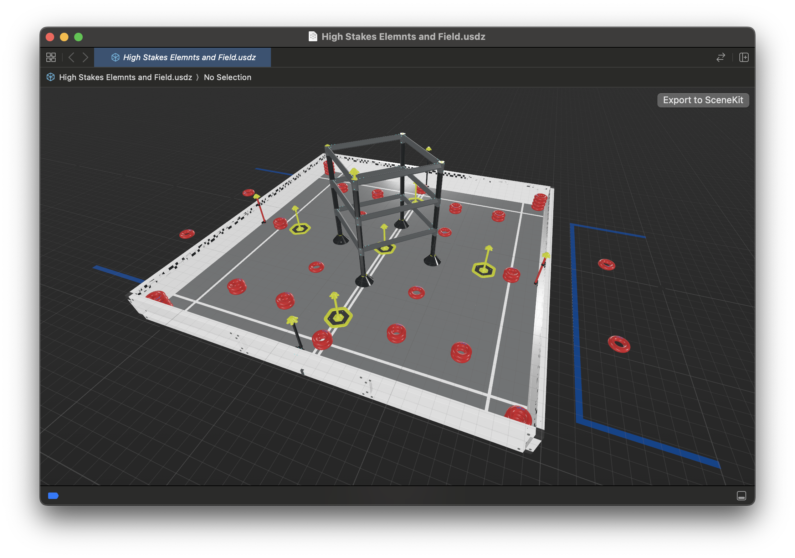

# VEX High Stakes AR Field

Welcome to the GitHub repository for the Augmented Reality (AR) field projection of the 2024-2025 VEX Robotics game, High Stakes. This project allows teams to interact with a virtual simulation of the upcoming game's field, facilitating early strategy development and practice, even before physical game elements are available.

## Features

- **Virtual Game Field:** Utilize AR to project the game field directly into your environment.
- **Two AR Models:** Choose from either a basic field model for overlay on existing setups or a complete setup model that includes field boundaries.
- **Compatible with Multiple Devices:** Supports a range of Apple devices including iPhones, iPads, and iPod touches.

## Getting Started

### Prerequisites

Before you start, ensure your device is compatible with ARKit and supports augmented reality (AR). The project files are designed to be used with the following Apple devices:

- **iPhone:** Model 6s or newer, or SE (1st generation) or newer
- **iPad:** 5th generation or newer
- **iPad Pro:** All models
- **iPod touch:** 7th generation
- **Vision Pro:** All models

## Download and Usage

Choose and download the appropriate AR model file to your device based on your setup needs:

### High Stakes Elements Only
For teams with existing field setups who need only the game elements.

[Download Elements Only Model](https://github.com/SuhJae/VEXHighStakesAR/raw/main/High%20Stakes%20Elements%20Only.usdz)

### High Stakes Elements and Field
For teams needing both the game elements and field boundaries.

[Download Elements and Field Model](https://github.com/SuhJae/VEXHighStakesAR/raw/main/High%20Stakes%20Elements%20and%20Field.usdz)

After downloading, you can access the AR model in two ways:

- **Using Files App:**
  - Navigate to the downloaded `.usdz` file in your Files app.
  - Tap on the file to open it directly in AR on your device.

- **Using Safari:**
  - Open Safari on your compatible device.
  - Paste the URL of the desired AR model into the browser to view it directly in Safari without downloading.
